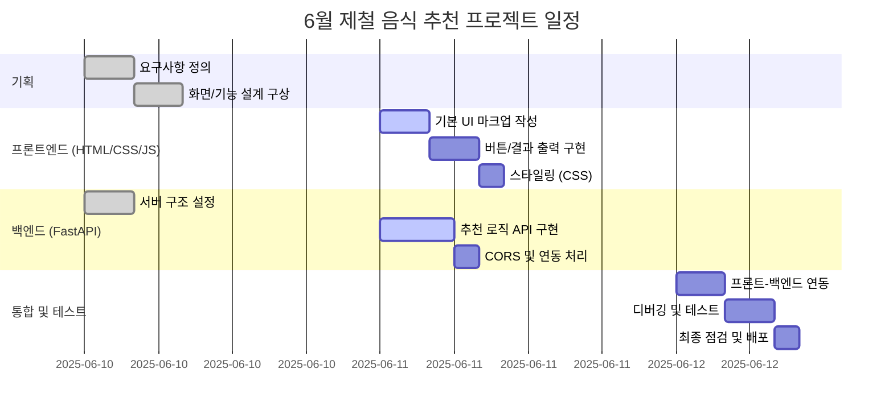

# WBS 작성
---

## 1일차 - 프로젝트 준비 및 설계
### 프로젝트 주제 확정: 6월 제철음식 추천 서비스
### git 레포지토리 생성
### 와이어프레임 작성 ppt or 그림판
### WBS 작성

---

## 2일차 - 개발
###  FastAPI 환경 초기 설정

---

## 3일차 - 테스트
### 테스트 및 점검

## wireframe img
